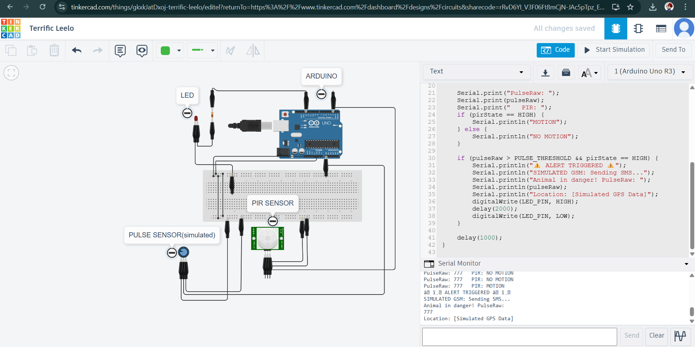

# Device-for-Endangered-species
A **low-cost Arduino-based smart collar** for monitoring endangered animals using **PIR sensor** (motion detection) and **Pulse sensor** (simulated via potentiometer).  
The system detects abnormal pulse or motion, then **triggers an alert (LED + Serial Monitor message)**, simulating GSM and GPS notifications.

---

## 📂 Files in this Repo
- `project-endangered_species.c` → Main Arduino C code.
- `circuit.png` → Circuit wiring diagram from Tinkercad.
- `output-smartcollar.png` → Serial Monitor alert output.
- `demo-smartcollar.mp4` → Simulation demo video.
- `Device_for_Endangered_Species.pptx` → Project presentation slides.

---

## ⚡ How It Works
1. **Inputs:** Pulse sensor (simulated by potentiometer) + PIR motion sensor.  
2. **Processing:** Arduino compares values against safe thresholds.  
3. **Output:**  
   - LED blinks and Serial Monitor prints simulated SMS/GPS alert.  
   - If both sensors go abnormal → triggers “⚠ ALERT! Animal in danger”.  
4. In real hardware, GSM module sends SMS and GPS provides live coordinates.

---

## ▶️ How to Run Simulation
1. Open [Tinkercad Circuits](https://www.tinkercad.com/circuits).  
2. Recreate the circuit (Arduino Uno + PIR + Potentiometer + LED).  
3. Upload the code from `project-endangered_species.c`.  
4. Click **Start Simulation** → Open **Serial Monitor** → Move PIR or adjust potentiometer to trigger alerts.

---

## 📸 Demo
**Circuit Design:**  

**Serial Monitor Output:**  

🎥 **Demo Video:** [demo-smartcollar.mp4](demo-smartcollar.mp4)

---

## 🚀 Future Scope
- Integrate **real GSM & GPS modules** for live location tracking.  
- Add **solar power support** for outdoor sustainability.  
- Use **AI/ML** models to predict abnormal animal behavior patterns.  

---

## 🧠 My Hardware Version Includes:
- **Real-Time GPS Module** for location tracking.  
- **GSM Module** for live SMS alert transmission.  
- **Rechargeable Battery & Collar Casing** for field deployment.

---

💡 *Developed by Priscilla Gracelin K — Smart Collar Project (Tinkercad + Arduino).*
